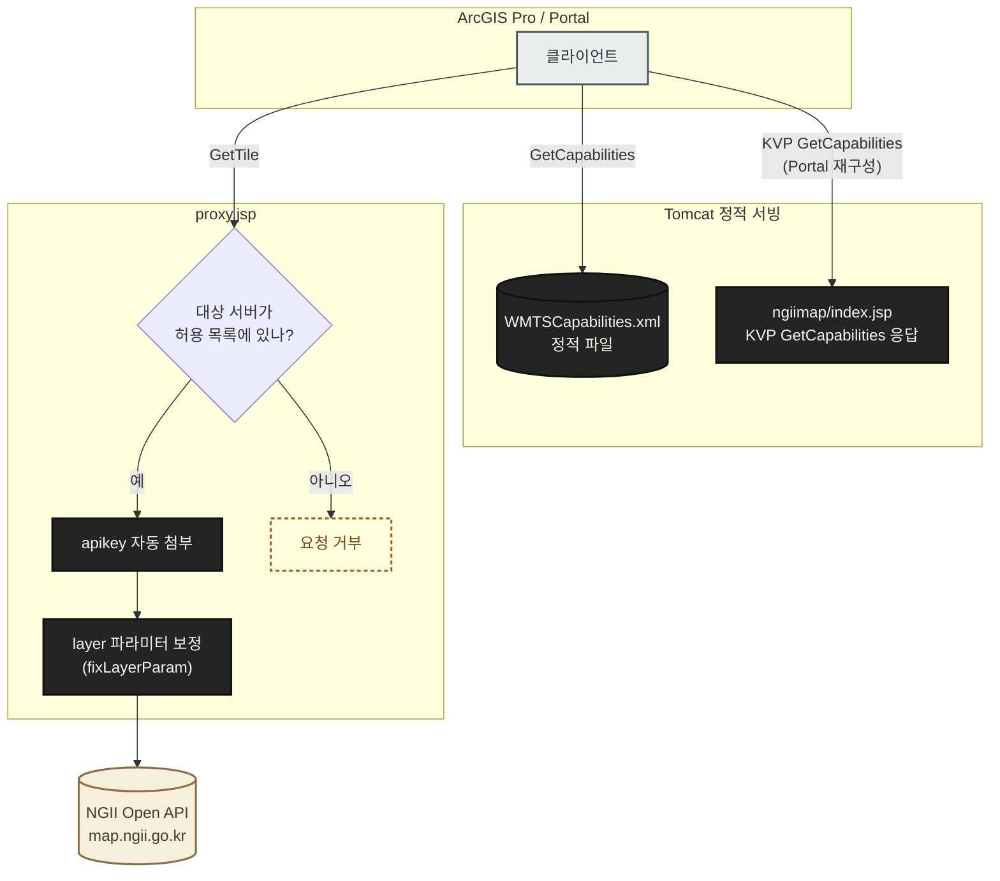
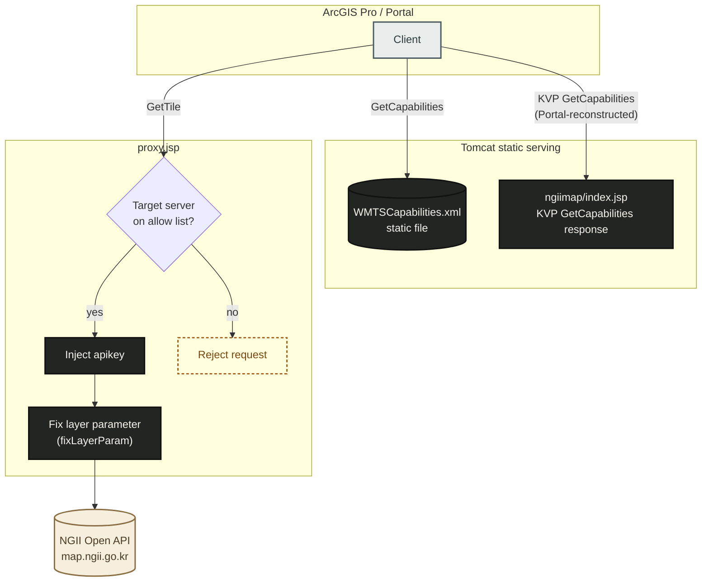

# esri-resource-proxy-ngii

[](./LICENSE)
[](#)
[](#)
[](https://www.ogc.org/standard/wmts/)
[](https://github.com/Esri/resource-proxy)
[](#esri-resource-proxy-ngii)
[](#english)

NGII(국토지리정보원)의 위성 및 항공 영상을 ArcGIS Pro와 ArcGIS Enterprise Portal에서 표준 OGC WMTS
레이어로 사용할 수 있도록 중계하는 프록시 서비스입니다. Esri의 오픈소스 프로젝트인
[resource-proxy](https://github.com/Esri/resource-proxy)(Java 빌드)를 기반으로 구성했으며, NGII
Open API 키는 클라이언트에 노출되지 않고 서버 측에만 보관됩니다.

## 배경

NGII Open API(`map.ngii.go.kr/openapi`)는 위성 및 항공 타일을 제공하지만 그 자체로는 WMTS 표준
엔드포인트가 아니며, 모든 타일 요청에 서버 측 `apikey`를 요구합니다. 반면 ArcGIS Pro와 Portal은
표준 OGC WMTS `GetCapabilities` 문서와 이에 대응하는 `GetTile` 요청 방식을 필요로 합니다. 본
프로젝트는 다음 세 가지 구성 요소로 두 인터페이스 사이의 차이를 해소합니다.

1. `WMTSCapabilities.xml`이 NGII의 타일 격자를 표준 WMTS 규격으로 기술합니다.
2. Esri `resource-proxy`(JSP)가 GIS 클라이언트와 NGII 사이에서 중계 역할을 수행하며, 나가는 모든
   요청에 `apikey`를 자동으로 첨부합니다. 이를 통해 ArcGIS Pro, Portal, 또는 클라이언트 측 네트워크
   트래픽을 확인하는 제3자 누구에게도 실제 키가 노출되지 않습니다.
3. 실제 운영 과정에서 발견된 문제를 해결하기 위해 `proxy.jsp`에 커스텀 코드를 두 곳 추가했습니다.
   자세한 내용은 아래 "알려진 이슈와 대응"을 참고하십시오.

## 동작 원리



`WMTSCapabilities.xml`은 NGII의 실제 타일 격자(원점, 해상도, 레벨별 행/열 수)를 기술하는 정적 파일이며, Tomcat이 이를 그대로 서빙합니다.

## 요구사항

- Apache Tomcat 9 이상 (JSP 2.3 / Servlet 4.0 이상 지원 버전)
- 실제로 발급받은 TLS 인증서가 커버하는 공인 도메인. `localhost` 또는 자체 서명 인증서로는 ArcGIS
  Pro와 Portal 양쪽 모두 정상 동작하지 않습니다 (아래 "알려진 이슈와 대응" 참고).
- NGII Open API 키 ([map.ngii.go.kr/mi/openKey/openKeyRegist.do](https://map.ngii.go.kr/mi/openKey/openKeyRegist.do)에서 발급)
- ArcGIS Pro 및 ArcGIS Enterprise Portal에서 이 서버로의 네트워크 접근이 가능해야 합니다.

## 설치

### 1. NGII Open API 키 발급

[map.ngii.go.kr/mi/openKey/openKeyRegist.do](https://map.ngii.go.kr/mi/openKey/openKeyRegist.do)에서
API 키를 신청합니다. 활용 URL을 등록할 때는 `localhost`가 아니라 이 Tomcat 인스턴스가 실제로 응답하는
공인 도메인을 입력합니다.

### 2. 저장소 내려받기

```bash
git clone https://github.com/hayein-bit/esri-resource-proxy-ngii.git
```

git이 없는 경우 저장소 페이지의 **Code → Download ZIP**을 통해 내려받아 압축을 해제해도 됩니다.

### 3. Tomcat에 배포

`proxy/` 폴더 전체를 Tomcat의 `webapps/` 하위에 원하는 이름(예: `Java`)으로 배치합니다.

```
webapps/Java/
├── proxy.jsp
├── WEB-INF/classes/proxy.config
└── ngiimap/
    ├── index.jsp
    └── 1.0.0/WMTSCapabilities.xml
```

### 4. 설정값 입력

| 파일 | 항목 | 값 |
| --- | --- | --- |
| `proxy.jsp` | `addApiKeyToUri()` 내부의 `YOUR_NGII_API_KEY_HERE` | 1단계에서 발급받은 실제 NGII API 키 |
| `ngiimap/1.0.0/WMTSCapabilities.xml` | `https://your-server.domain.com` (여러 곳) | 이 Tomcat이 실제로 응답하는 공인 HTTPS 도메인 |
| `WEB-INF/classes/proxy.config` | `serverUrls` | 기본값(`map.ngii.go.kr/openapi/`)으로 충분합니다. `mustMatch="true"`이므로 목록에 없는 대상 서버는 모두 거부됩니다. |

`WMTSCapabilities.xml`에 지정하는 도메인은 ArcGIS Pro를 실행하는 PC와 ArcGIS Enterprise Portal
서버 양쪽 모두에서 네트워크로 접근 가능해야 하며, TLS 인증서가 실제로 커버하는 이름이어야 합니다.

### 5. Tomcat 재시작

`proxy.config`를 처음 배포하거나 수정했을 때만 필요합니다. `.jsp` 파일은 Tomcat이 수정 시각을
감지해 자동으로 재컴파일하므로 재시작이 필요하지 않습니다.

### 6. 동작 확인

```powershell
# GetCapabilities
Invoke-WebRequest -Uri "https://your-server.domain.com/Java/ngiimap/1.0.0/WMTSCapabilities.xml"

# 타일 하나 (200, image/png, 수 KB 이상의 바이트면 정상)
Invoke-WebRequest -Uri "https://your-server.domain.com/Java/proxy.jsp?https://map.ngii.go.kr/openapi/Gettile.do?service=WMTS&request=GetTile&version=1.0.0&layer=satellite_map&style=korean&format=image/png&tilematrixset=korean&tilematrix=L10&tilerow=100&tilecol=60"
```

### 7. ArcGIS Pro / Portal 연결

**ArcGIS Pro**: 카탈로그 → 서버 → 서버에 연결(또는 삽입 → 연결 → 서버에 연결)에서
`https://your-server.domain.com/Java/ngiimap/1.0.0/WMTSCapabilities.xml`을 입력합니다. 연결되면
`위성지도(satellite_map)` 레이어가 나타나며, 지도에 추가해 팬/줌 시 정상적으로 로드되는지 확인합니다.

**Portal**: 콘텐츠 → 새 항목 → URL에서 동일한 캡캐빌리티 URL을 입력하고 유형을 WMTS(OGC)로
선택해 저장합니다. 이 항목을 웹맵에 추가한 뒤에는 웹맵을 닫았다가 다시 열어서도 레이어가 표시되는지
확인해 두는 것이 좋습니다.

서버의 `WMTSCapabilities.xml`을 나중에 수정한 경우, 이미 만들어진 ArcGIS Pro 연결이나 Portal
콘텐츠 아이템은 자동으로 갱신되지 않습니다. 각각 삭제 후 다시 만들어야 변경 사항이 반영됩니다
(원인은 아래 "알려진 이슈와 대응" 참고).

## 프로젝트 구조

```
esri-resource-proxy-ngii/
├── LICENSE
├── README.md
└── proxy/
    ├── proxy.jsp                        Esri resource-proxy 본체 및 커스텀 추가 2건
    ├── WEB-INF/
    │   └── classes/
    │       └── proxy.config             프록시 허용 대상 서버 목록
    └── ngiimap/
        ├── index.jsp                    KVP 방식 GetCapabilities 응답 처리
        └── 1.0.0/
            └── WMTSCapabilities.xml     WMTS 서비스 기술 문서
```

## 알려진 이슈와 대응

실제 운영 과정에서 확인된 문제와 그 대응입니다.

| 증상 | 원인 | 대응 |
| --- | --- | --- |
| `localhost`로는 접속되지만 ArcGIS Pro/Portal에서는 접속되지 않음. Portal은 "서비스가 존재하지 않거나 접근할 수 없습니다"를 반환 | TLS 인증서가 `*.your-domain.com`은 커버하지만 `localhost`는 커버하지 않음. 인증서를 정상적으로 검증하는 클라이언트는 연결에 실패함. `curl -k`나 인증서 검증을 비활성화한 스크립트로 테스트하면 이 문제가 가려짐 | 연결 URL뿐 아니라 `WMTSCapabilities.xml` 내 모든 URL(`ResourceURL` 템플릿, `GetCapabilities`/`GetTile` 오퍼레이션 href)을 실제 공인 도메인으로 통일 |
| 특정 위치에서 타일이 비어 보이며, 팬/줌 위치에 따라 빈 영역이 이동함 | `MatrixWidth`/`MatrixHeight`가 원점 및 해상도가 의미하는 실제 격자보다 작게 선언됨. 해당 범위 밖의 타일은 오류 없이 조용히 요청 불가능한 상태가 됨 | 격자 크기를 원점, 해상도, 실제 커버리지 기준으로 재계산. 필요시 NGII 공식 웹뷰어 스크립트(`https://map.ngii.go.kr/openapi/wmts_ngiiMap_v6.4.3.js?apikey=...`)에서 정확한 `origin`/`resolutions`/격자 범위를 확인 |
| 레이어를 처음 추가했을 때는 정상 표시되지만, 웹맵을 저장 후 다시 열거나 ArcGIS Pro의 열기로 열면 아무것도 표시되지 않음 | `Layer`에 `ows:WGS84BoundingBox`/`ows:BoundingBox`가 선언되어 있지 않아, 클라이언트가 기본 확장 범위를 계산할 때 거대하고 비어 있는 전체 격자 범위로 귀결됨 | `Layer`에 WGS84 bounding box와 원본 좌표계(예: EPSG:5179) bounding box를 함께 선언 |
| Portal에서 저장된 웹맵을 다시 열 때 `GetCapabilities`가 404를 반환 | Portal이 레이어를 처음 추가할 때 사용한 RESTful URL을 그대로 재사용하지 않고, `.../ngiimap/?request=GetCapabilities&service=WMTS&version=1.0.0`과 같은 KVP 형식을 자체적으로 재구성하여 요청함 | `ngiimap/index.jsp`가 쿼리 문자열과 무관하게 동일한 캡캐빌리티 문서로 응답 (Tomcat의 welcome file 메커니즘 이용) |
| 타일 요청은 200으로 성공하지만 화면에는 아무것도 표시되지 않음 | Portal이 KVP 방식 `GetTile`을 자체적으로 재구성하면서 `layer=korean`(NGII의 스타일 이름이며 레이어 이름이 아님)을 잘못된 값으로 전송함. NGII는 인식할 수 없는 레이어에 대해 오류 없이 빈 본문으로 200을 응답함 | `proxy.jsp`의 `fixLayerParam()`이 NGII로 전달되기 직전 레이어 값을 서버 측에서 강제로 교정 |
| 서버 측을 수정했음에도 ArcGIS Pro/Portal의 동작에 변화가 없음 | ArcGIS Pro는 WMTS 서버 연결 자체를 Tomcat 프로세스 및 Pro 프로세스와 무관하게 캐싱함. 이와 별개로 Portal 콘텐츠 아이템은 등록 시점의 타일 격자/LOD 메타데이터를 자체적으로 캐싱함 | ArcGIS Pro 측 연결은 삭제 후 재생성하고, Portal 콘텐츠 아이템은 삭제 후 재등록. 아래 로그를 통해 클라이언트가 실제로 서버에 재요청을 보냈는지 먼저 확인 |

## 트러블슈팅

`proxy.config`에 지정된 `logFile="proxy_log.log"` 로그와 Tomcat의 access log는, 화면 캡처만으로
추정하는 것보다 훨씬 정확하게 문제를 좁혀 줍니다. 문제를 재현하면서 두 로그를 함께 확인하면 다음을
파악할 수 있습니다.

- 클라이언트가 실제로 서버에 새 요청을 보냈는지 여부 (캐싱 문제와 서버 측 결함을 구분)
- 클라이언트가 정확히 어떤 파라미터로 요청했는지 (예: 위 표의 `layer=korean` 사례)
- NGII가 실제로 어떤 응답을 반환했는지 (본문이 비어 있는 `200 OK` 포함)

## 라이선스

`proxy.jsp`와 `WEB-INF` 구조는 Esri [resource-proxy](https://github.com/Esri/resource-proxy)에서
가져온 것으로 Apache License 2.0을 따릅니다. 자세한 내용은 `LICENSE` 파일을 참고하십시오.
`proxy.jsp` 내 "CUSTOM ADDITION"으로 표시된 부분과 `ngiimap/` 캡캐빌리티 문서, KVP 응답용 shim은
본 프로젝트를 위해 새로 작성했습니다.

---

<a id="english"></a>

## English

[](#esri-resource-proxy-ngii)
[](#english)

A proxy service that lets ArcGIS Pro and ArcGIS Enterprise Portal consume NGII (National
Geographic Information Institute of Korea) satellite and aerial imagery as a standard OGC WMTS
layer. It is built on Esri's open source [resource-proxy](https://github.com/Esri/resource-proxy)
(the Java build), configured so the NGII Open API key is never exposed to a client and stays on
the server side only.

### Background

NGII's Open API (`map.ngii.go.kr/openapi`) serves aerial and satellite tiles, but it is not a
standard WMTS endpoint, and every tile request requires a server side `apikey`. ArcGIS Pro and
Portal, by contrast, require a standard OGC WMTS `GetCapabilities` document and a corresponding
`GetTile` request format. This project reconciles the two interfaces through three components.

1. `WMTSCapabilities.xml` describes NGII's tile grid in standard WMTS terms.
2. Esri's `resource-proxy` (JSP) mediates between the GIS client and NGII, attaching an `apikey`
   to every outbound request automatically. As a result, the real key is never exposed to ArcGIS
   Pro, Portal, or any third party inspecting client side network traffic.
3. Two custom additions were made to `proxy.jsp` to resolve issues identified during production
   use. See "Known issues and how they're handled" below for details.

### How it works



`WMTSCapabilities.xml` is a static file describing NGII's real tile grid (origin, resolution, columns/rows per zoom level). Tomcat serves it as is.

### Requirements

- Apache Tomcat 9 or later (any version supporting JSP 2.3 / Servlet 4.0 or newer)
- A public domain covered by an actual, issued TLS certificate. `localhost` or a self signed
  certificate will not function correctly with either ArcGIS Pro or Portal (see Known issues
  below).
- An NGII Open API key (issued at [map.ngii.go.kr/mi/openKey/openKeyRegist.do](https://map.ngii.go.kr/mi/openKey/openKeyRegist.do)).
- Network reachability to this server from both ArcGIS Pro and ArcGIS Enterprise Portal.

### Installation

#### 1. Obtain an NGII Open API key

Apply for a key at
[map.ngii.go.kr/mi/openKey/openKeyRegist.do](https://map.ngii.go.kr/mi/openKey/openKeyRegist.do).
When registering the URL that will use the key, provide the real public domain this Tomcat
instance actually responds on, not `localhost`.

#### 2. Obtain the repository

```bash
git clone https://github.com/hayein-bit/esri-resource-proxy-ngii.git
```

If git is not available, the repository can also be downloaded as a ZIP from the repository page
(**Code → Download ZIP**) and extracted.

#### 3. Deploy to Tomcat

Place the entire `proxy/` folder under Tomcat's `webapps/`, under whatever context name is
preferred (for example `Java`).

```
webapps/Java/
├── proxy.jsp
├── WEB-INF/classes/proxy.config
└── ngiimap/
    ├── index.jsp
    └── 1.0.0/WMTSCapabilities.xml
```

#### 4. Populate configuration values

| File | Field | Value |
| --- | --- | --- |
| `proxy.jsp` | `YOUR_NGII_API_KEY_HERE` inside `addApiKeyToUri()` | The real NGII API key obtained in step 1 |
| `ngiimap/1.0.0/WMTSCapabilities.xml` | `https://your-server.domain.com` (multiple occurrences) | The real public HTTPS domain this Tomcat instance responds on |
| `WEB-INF/classes/proxy.config` | `serverUrls` | The default (`map.ngii.go.kr/openapi/`) is sufficient. `mustMatch="true"` means any target server not on this list is rejected. |

The domain specified in `WMTSCapabilities.xml` must be reachable over the network from both the
machine running ArcGIS Pro and the ArcGIS Enterprise Portal server, and must be a name actually
covered by the TLS certificate.

#### 5. Restart Tomcat

Required only on initial deployment, or after modifying `proxy.config`. `.jsp` files are
recompiled automatically by Tomcat whenever their modification timestamp changes, so no restart is
required for those.

#### 6. Verify the deployment

```powershell
# GetCapabilities
Invoke-WebRequest -Uri "https://your-server.domain.com/Java/ngiimap/1.0.0/WMTSCapabilities.xml"

# A single tile (expect 200, image/png, at least a few KB in size)
Invoke-WebRequest -Uri "https://your-server.domain.com/Java/proxy.jsp?https://map.ngii.go.kr/openapi/Gettile.do?service=WMTS&request=GetTile&version=1.0.0&layer=satellite_map&style=korean&format=image/png&tilematrixset=korean&tilematrix=L10&tilerow=100&tilecol=60"
```

#### 7. Connect ArcGIS Pro / Portal

**ArcGIS Pro**: Catalog → Servers → New Server Connection (or Insert → Connections → Server
Connection), and enter
`https://your-server.domain.com/Java/ngiimap/1.0.0/WMTSCapabilities.xml`. Once connected, the
`satellite_map` layer appears; add it to a map and confirm tiles load correctly while panning and
zooming.

**Portal**: Content → New item → URL, enter the same capabilities URL, set the item type to WMTS
(OGC), and save. After adding this item to a web map, it's worth closing and reopening the web map
to confirm the layer still renders.

If `WMTSCapabilities.xml` is modified on the server later, an existing ArcGIS Pro connection or
Portal content item will not pick up the change automatically. Both need to be deleted and
recreated for the change to take effect (see "Known issues and how they're handled" below for
why).

### Project structure

```
esri-resource-proxy-ngii/
├── LICENSE
├── README.md
└── proxy/
    ├── proxy.jsp                        Esri resource-proxy plus two custom additions
    ├── WEB-INF/
    │   └── classes/
    │       └── proxy.config             Allow list of target servers for the proxy
    └── ngiimap/
        ├── index.jsp                    Handles KVP style GetCapabilities requests
        └── 1.0.0/
            └── WMTSCapabilities.xml     The WMTS service description
```

### Known issues and how they're handled

These were identified during production operation of this exact service. Worth reviewing before
concluding that a new symptom is a distinct defect.

| Symptom | Cause | Resolution |
| --- | --- | --- |
| Reachable over `localhost` but not from ArcGIS Pro or Portal; Portal reports "the service does not exist or cannot be accessed" | The TLS certificate covers `*.your-domain.com` but not `localhost`. A client that validates certificates correctly fails outright. Testing with `curl -k` or a script with certificate validation disabled conceals this entirely | Use the real public domain consistently, not only in the connection URL but in every URL inside `WMTSCapabilities.xml` (the `ResourceURL` template and both operation hrefs) |
| Tiles are blank at a specific location, and the blank area shifts depending on pan or zoom position | `MatrixWidth`/`MatrixHeight` declared smaller than what the origin and resolution actually imply. Tiles outside that undersized boundary become silently unreachable, with no error raised | Recompute the grid dimensions from the actual origin, resolution, and coverage extent. NGII's official web viewer script (`https://map.ngii.go.kr/openapi/wmts_ngiiMap_v6.4.3.js?apikey=...`) is the authoritative source for `origin`/`resolutions`/extent if these need to be rederived |
| The layer displays correctly immediately after being added, but shows nothing after saving and reopening a web map, or when opened via ArcGIS Pro's Open command | The `Layer` declares no `ows:WGS84BoundingBox`/`ows:BoundingBox`, so a client computing a default "zoom to layer" view falls back to the full, largely empty tile matrix extent | Declare both a WGS84 bounding box and a native CRS bounding box (for example EPSG:5179) on the `Layer` |
| Reopening a saved Portal web map returns a 404 on `GetCapabilities` | Portal does not always replay the exact RESTful URL used when the layer was originally added; it has been observed reconstructing a KVP style request such as `.../ngiimap/?request=GetCapabilities&service=WMTS&version=1.0.0` on its own | `ngiimap/index.jsp` responds with the same capabilities document regardless of query string, using Tomcat's welcome file mechanism |
| Tile requests return 200 but nothing is rendered | Portal's own KVP `GetTile` reconstruction has been observed sending `layer=korean` (an NGII style name, not a layer name). NGII returns `200 OK` with an empty body for an unrecognized layer, with no visible error | `fixLayerParam()` in `proxy.jsp` forcibly corrects the layer value server side immediately before the request reaches NGII |
| Server side fixes appear to have no effect on ArcGIS Pro or Portal behavior | ArcGIS Pro caches WMTS server connections independent of both the Tomcat process and the Pro process. Separately, a Portal content item caches its own tile grid/LOD metadata at the time it is registered | Delete and recreate the ArcGIS Pro connection, and separately delete and re-register the Portal content item. Consult the logs described below first, to confirm whether the client reached the server again at all |

### Troubleshooting

The log configured via `proxy.config`'s `logFile="proxy_log.log"`, together with Tomcat's own
access log, narrows down problems far more reliably than inferring from a screenshot alone. While
reproducing an issue, monitoring both logs simultaneously reveals:

- Whether the client actually sent a new request to the server (distinguishes a caching issue from
  a genuine server side defect)
- The exact parameters the client sent (catches request construction issues such as the
  `layer=korean` case above)
- What NGII actually returned, including a `200 OK` with an empty body

### License

`proxy.jsp` and the `WEB-INF` layout are derived from Esri's
[resource-proxy](https://github.com/Esri/resource-proxy), licensed under the Apache License,
Version 2.0. See `LICENSE` for details. The sections marked "CUSTOM ADDITION" within `proxy.jsp`,
along with the `ngiimap/` capabilities document and the KVP response shim, were written for this
project.
